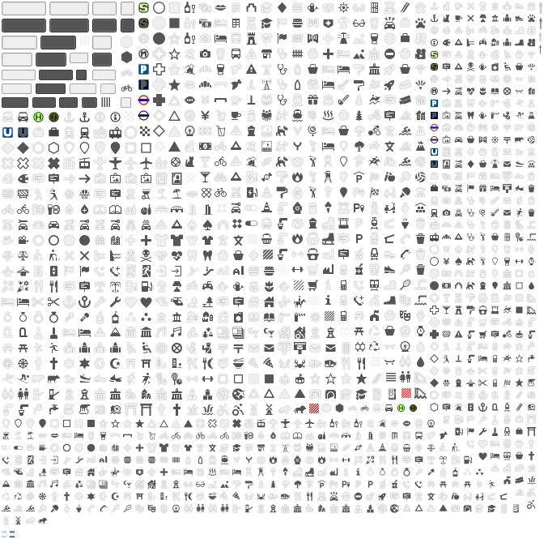

# Versatile Sprites

Create Sprites from SVG Images, apply colors, sizes, glow and render for different pixel ratios.

## I just want the sprites

* [Download](https://github.com/versatiles-org/versatiles-sprites/releases)

## Usage

* `npm run import-maki` — Import SVG icons from the [Maki Icon Set](https://github.com/mapbox/maki)
* `npm run assemble-spritemaps` — Compose Icons into spritemaps as defined in [`config.json`](./config.json)
* `npm run dist` — Create a protable tar.gz to use with [`versatiles serve`](https://github.com/versatiles-org/versatiles#run)

## SVG Sources

* SVG sources should consist only of paths and not contain any `transform()`s.
* Colors and styles are ignored.
* All lengths must be in pixels without unit.

## Configuration

Iconsets can be defined in [`config.json`](./config.json);
* `colors` are applied to each path in the order they appear in the source SVG.
* `size` applies to the height

## Licenses

* Sourcecode: [Unlicense](./UNLICENSE.md)
* Iconsets and rendered Spritemaps: [CC0 1.0 Universal](./icons/LICENSE.md)

